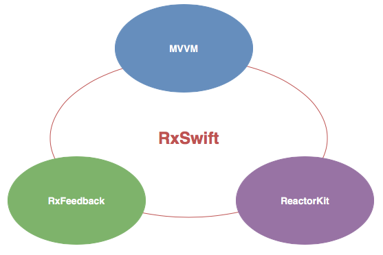

# 7. RxSwift 常用架构

[RxSwift](https://github.com/ReactiveX/RxSwift) 是一个**响应式编程**的基础框架，它并不会强制要求你使用某种架构。它和多个应用程序架构完美适配，这一章将介绍几个常用的架构：

* [**MVVM**](mvvm/) **- 当今非常流行的 MVVM 设计模式**
* [**RxFeedback**](rxfeedback/) **- 由** [**RxSwift 创始人（Krunoslav Zaher）**](https://github.com/kzaher) **提供的一个反馈循环架构**
* [**ReactorKit**](reactorkit/) **- 结合了** [**Flux**](https://facebook.github.io/flux/) **和**[**响应式编程**](https://zh.wikipedia.org/wiki/响应式编程)**的架构**

