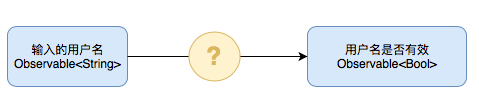

# 5. 如何选择操作符？

下面这个**决策树**可以帮助你找到需要的操作符。

## 决策树

**我想要创建一个 `Observable`**

* 产生特定的一个元素：[just](just.md)
  * 经过一段延时：[timer](timer.md)
* 从一个序列拉取元素：[from](from.md)
* 重复的产生某一个元素：[repeatElement](repeatelement.md)
* 存在自定义逻辑：[create](create.md)
* 每次订阅时产生：[deferred](deferred.md)
* 每隔一段时间，发出一个元素：[interval](interval.md)
  * 在一段延时后：[timer](timer.md)
* 一个空序列，只有一个完成事件：[empty](empty.md)
* 一个任何事件都没有产生的序列：[never](never.md)

**我想要创建一个 `Observable` 通过组合其他的 `Observables`**

* 任意一个 `Observable` 产生了元素，就发出这个元素：[merge](merge.md)
* 让这些 `Observables` 一个接一个的发出元素，当上一个 `Observable` 元素发送完毕后，下一个  `Observable` 才能开始发出元素：[concat](concat.md)
* 组合多个 `Observables` 的元素
  * 当每一个 `Observable` 都发出一个新的元素：[zip](zip.md)
  * 当任意一个 `Observable` 发出一个新的元素：[combineLatest](combinelatest.md)

**我想要转换 `Observable` 的元素后，再将它们发出来**

* 对每个元素直接转换：[map](map.md)
* 转换到另一个 `Observable`：[flatMap](flatmap.md)
  * 只接收最新的元素转换的 `Observable` 所产生的元素：[flatMapLatest](flatmaplatest.md)
  * 每一个元素转换的 `Observable` 按顺序产生元素：[concatMap](concatmap.md)
* 基于所有遍历过的元素： [scan](scan.md)

**我想要将产生的每一个元素，拖延一段时间后再发出：**[**delay**](delay.md)

**我想要将产生的事件封装成元素发送出来**

* 将他们封装成 `Event<Element>`：[materialize](materialize.md)
  * 然后解封出来：[dematerialize](dematerialize.md)

**我想要忽略掉所有的 `next` 事件，只接收 `completed` 和 `error` 事件：**[**ignoreElements**](ignoreelements.md)

**我想创建一个新的 `Observable` 在原有的序列前面加入一些元素：**[**startWith**](startwith.md)

**我想从 `Observable` 中收集元素，缓存这些元素之后在发出：**[**buffer**](buffer.md)

**我想将 `Observable` 拆分成多个 `Observables`：**[**window**](window.md)

* 基于元素的共同特征：[groupBy](groupby.md)

**我想只接收 `Observable` 中特定的元素**

* 发出唯一的元素：[single](single.md)

**我想重新从 `Observable` 中发出某些元素**

* 通过判定条件过滤出一些元素：[filter](filter.md)
* 仅仅发出头几个元素：[take](take.md)
* 仅仅发出尾部的几个元素：[takeLast](takelast.md)
* 仅仅发出第 n 个元素：[elementAt](elementat.md)
* 跳过头几个元素  
  * 跳过头 n 个元素：[skip](skip.md)
  * 跳过头几个满足判定的元素：[skipWhile](skipwhile.md)，[skipWhileWithIndex](skipwhile.md)
  * 跳过某段时间内产生的头几个元素：[skip](skip.md)
  * 跳过头几个元素直到另一个 `Observable` 发出一个元素：[skipUntil](skipuntil.md)
* 只取头几个元素
  * 只取头几个满足判定的元素：[takeWhile](takewhile.md)，[takeWhileWithIndex](takewhile.md)
  * 只取某段时间内产生的头几个元素：[take](take.md)
  * 只取头几个元素直到另一个 `Observable` 发出一个元素：[takeUntil](takeuntil.md)
* 周期性的对 `Observable` 抽样：[sample](sample.md)
* 发出那些元素，这些元素产生后的特定的时间内，没有新的元素产生：[debounce](debounce.md)
* 直到元素的值发生变化，才发出新的元素：[distinctUntilChanged](distinctuntilchanged.md)
  * 并提供元素是否相等的判定函数：[distinctUntilChanged](distinctuntilchanged.md)
* 在开始发出元素时，延时后进行订阅：[delaySubscription](delaysubscription.md)

**我想要从一些 `Observables` 中，只取第一个产生元素的 `Observable`：**[**amb**](amb.md)

**我想评估 `Observable` 的全部元素**

* 并且对每个元素应用聚合方法，待所有元素都应用聚合方法后，发出结果：[reduce](reduce.md)
* 并且对每个元素应用聚合方法，每次应用聚合方法后，发出结果：[scan](scan.md)

**我想把 `Observable` 转换为其他的数据结构：as...**

**我想在某个** [**Scheduler**](../rxswift_core/schedulers.md) **应用操作符：**[**subscribeOn**](subscribeon.md)

* 在某个 [Scheduler](../rxswift_core/schedulers.md) 监听：[observeOn](observeon.md)

**我想要 `Observable` 发生某个事件时, 采取某个行动：**[**do**](do.md)

**我想要 `Observable` 发出一个 `error` 事件：**[**error**](error.md)

* 如果规定时间内没有产生元素：[timeout](timeout.md)

**我想要 `Observable` 发生错误时，优雅的恢复**

* 如果规定时间内没有产生元素，就切换到备选 `Observable` ：[timeout](timeout.md)
* 如果产生错误，将错误替换成某个元素 ：[catchErrorJustReturn](catcherror.md)
* 如果产生错误，就切换到备选 `Observable` ：[catchError](catcherror.md)
* 如果产生错误，就重试 ：[retry](retry.md)

**我创建一个 `Disposable` 资源，使它与 `Observable` 具有相同的寿命：**[**using**](using.md)

**我创建一个 `Observable`，直到我通知它可以产生元素后，才能产生元素：**[**publish**](publish.md)

* 并且，就算是在产生元素后订阅，也要发出全部元素：[replay](replay.md)
* 并且，一旦所有观察者取消观察，他就被释放掉：[refCount](refcount.md)
* 通知它可以产生元素了：[connect](connect.md)

