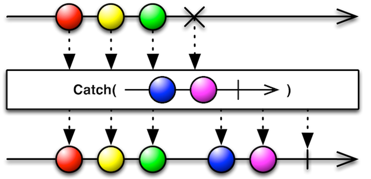

# catchError

## catchError

**从一个错误事件中恢复，将错误事件替换成一个备选序列**



**catchError** 操作符将会拦截一个 `error` 事件，将它替换成其他的元素或者一组元素，然后传递给观察者。这样可以使得 `Observable` 正常结束，或者根本都不需要结束。

这里存在其他版本的 `catchError` 操作符。

### 演示

```swift
let disposeBag = DisposeBag()

let sequenceThatFails = PublishSubject<String>()
let recoverySequence = PublishSubject<String>()

sequenceThatFails
    .catchError {
        print("Error:", $0)
        return recoverySequence
    }
    .subscribe { print($0) }
    .disposed(by: disposeBag)

sequenceThatFails.onNext("😬")
sequenceThatFails.onNext("😨")
sequenceThatFails.onNext("😡")
sequenceThatFails.onNext("🔴")
sequenceThatFails.onError(TestError.test)

recoverySequence.onNext("😊")
```

**输出结果：**

```swift
next(😬)
next(😨)
next(😡)
next(🔴)
Error: test
next(😊)
```

## catchErrorJustReturn

**catchErrorJustReturn** 操作符会将`error` 事件替换成其他的一个元素，然后结束该序列。

### 演示

```swift
let disposeBag = DisposeBag()
let sequenceThatFails = PublishSubject<String>()

sequenceThatFails
    .catchErrorJustReturn("😊")
    .subscribe { print($0) }
    .disposed(by: disposeBag)

sequenceThatFails.onNext("😬")
sequenceThatFails.onNext("😨")
sequenceThatFails.onNext("😡")
sequenceThatFails.onNext("🔴")
sequenceThatFails.onError(TestError.test)
```

**输出结果：**

```swift
next(😬)
next(😨)
next(😡)
next(🔴)
next(😊)
completed
```

