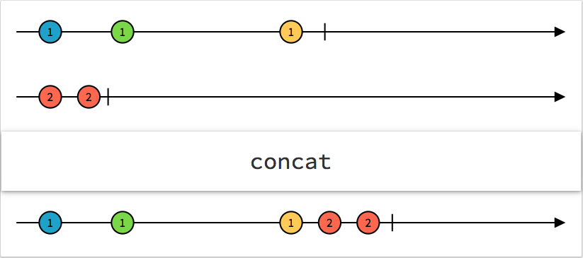

# concat

**让两个或多个 `Observables` 按顺序串连起来**



**concat** 操作符将多个 `Observables` 按顺序串联起来，当前一个 `Observable` 元素发送完毕后，后一个 `Observable` 才可以开始发出元素。

**concat** 将等待前一个 `Observable` 产生完成事件后，才对后一个 `Observable` 进行订阅。如果后一个是“热” `Observable` ，在它前一个 `Observable` 产生完成事件前，所产生的元素将不会被发送出来。

[startWith](startwith.md) 和它十分相似。但是 [startWith](startwith.md) 不是在后面添加元素，而是在前面插入元素。

[merge](merge.md) 和它也是十分相似。[merge](merge.md) 并不是将多个 `Observables` 按顺序串联起来，而是将他们合并到一起，不需要 `Observables` 按先后顺序发出元素。

## 演示

```swift
let disposeBag = DisposeBag()

let subject1 = BehaviorSubject(value: "🍎")
let subject2 = BehaviorSubject(value: "🐶")

let subject = BehaviorSubject(value: subject1)

subject
    .asObservable()
    .concat()
    .subscribe { print($0) }
    .disposed(by: disposeBag)

subject1.onNext("🍐")
subject1.onNext("🍊")

subject.onNext(subject2)

subject2.onNext("I would be ignored")
subject2.onNext("🐱")

subject1.onCompleted()

subject2.onNext("🐭")
```

**输出结果：**

```swift
next(🍎)
next(🍐)
next(🍊)
next(🐱)
next(🐭)
```

