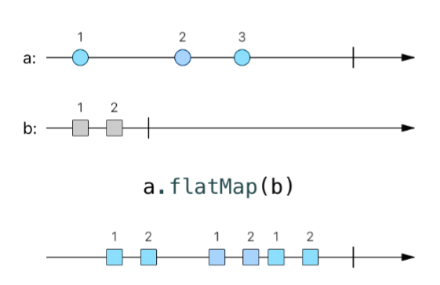

# flatMap

**将 `Observable` 的元素转换成其他的 `Observable`，然后将这些 `Observables` 合并**



**flatMap** 操作符将源 `Observable` 的每一个元素应用一个转换方法，将他们转换成 `Observables`。 然后将这些 `Observables` 的元素合并之后再发送出来。

这个操作符是非常有用的，例如，当 `Observable` 的元素本身拥有其他的 `Observable` 时，你可以将所有**子** `Observables` 的元素发送出来。

## 演示

```swift
let disposeBag = DisposeBag()
let first = BehaviorSubject(value: "👦🏻")
let second = BehaviorSubject(value: "🅰️")
let subject = BehaviorSubject(value: first)

subject.asObservable()
        .flatMap { $0 }
        .subscribe(onNext: { print($0) })
        .disposed(by: disposeBag)

first.onNext("🐱")
subject.onNext(second)
second.onNext("🅱️")
first.onNext("🐶")
```

**输出结果：**

```swift
👦🏻
🐱
🅰️
🅱️
🐶
```

