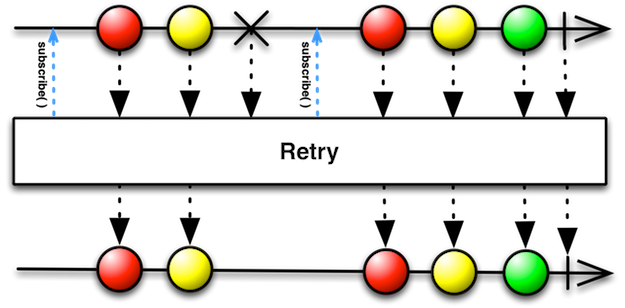

# retry

**如果源 `Observable` 产生一个错误事件，重新对它进行订阅，希望它不会再次产生错误**



**retry** 操作符将不会将 `error` 事件，传递给观察者，然而，它会从新订阅源 `Observable`，给这个 `Observable` 一个重试的机会，让它有机会不产生 `error` 事件。**retry** 总是对观察者发出 `next` 事件，即便源序列产生了一个 `error` 事件，所以这样可能会产生重复的元素（如上图所示）。

## 演示 1

```swift
let disposeBag = DisposeBag()
var count = 1

let sequenceThatErrors = Observable<String>.create { observer in
    observer.onNext("🍎")
    observer.onNext("🍐")
    observer.onNext("🍊")

    if count == 1 {
        observer.onError(TestError.test)
        print("Error encountered")
        count += 1
    }

    observer.onNext("🐶")
    observer.onNext("🐱")
    observer.onNext("🐭")
    observer.onCompleted()

    return Disposables.create()
}

sequenceThatErrors
    .retry()
    .subscribe(onNext: { print($0) })
    .disposed(by: disposeBag)
```

**输出结果：**

```swift
🍎
🍐
🍊
Error encountered
🍎
🍐
🍊
🐶
🐱
🐭
```

## 演示 2

```swift
let disposeBag = DisposeBag()
var count = 1

let sequenceThatErrors = Observable<String>.create { observer in
    observer.onNext("🍎")
    observer.onNext("🍐")
    observer.onNext("🍊")

    if count < 5 {
        observer.onError(TestError.test)
        print("Error encountered")
        count += 1
    }

    observer.onNext("🐶")
    observer.onNext("🐱")
    observer.onNext("🐭")
    observer.onCompleted()

    return Disposables.create()
}

sequenceThatErrors
    .retry(3)
    .subscribe(onNext: { print($0) })
    .disposed(by: disposeBag)
```

**输出结果：**

```swift
🍎
🍐
🍊
Error encountered
🍎
🍐
🍊
Error encountered
🍎
🍐
🍊
Error encountered
Unhandled error happened: test
 subscription called from:
```

