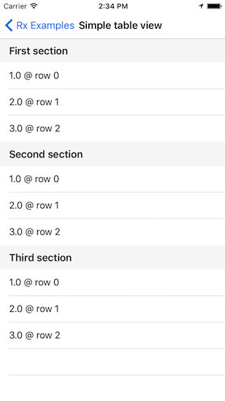
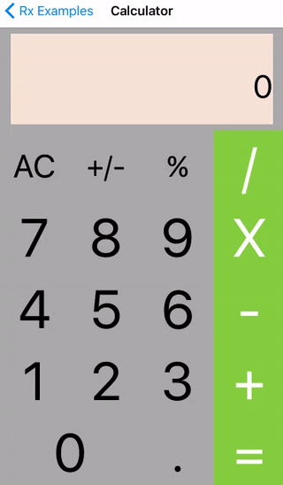

# 6. 更多示例

|  |  |  |
| :--- | :--- | :--- |

[RxExample](https://github.com/ReactiveX/RxSwift/tree/master/RxExample/RxExample/Examples) 中包含许多具有代表性的示例。它们都是**很好的学习材料**。这里我们取出其中几个示例来展示如何应用 **RxSwift** ：

* [**ImagePicker**](image_picker.md) **- 图片选择器**
* [**TableViewSectionedViewController**](tableview_sectioned_viewcontroller.md) **- 多层级的列表页**
* [**Calculator**](calculator.md) **- 计算器**

有兴趣的同学还可以研究一下 [RxExample](https://github.com/ReactiveX/RxSwift/tree/master/RxExample/RxExample/Examples) 中其他的示例。

