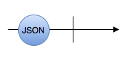

# 附加作用

## 什么是函数的 [附加作用](https://zh.wikipedia.org/wiki/%E5%87%BD%E6%95%B0%E5%89%AF%E4%BD%9C%E7%94%A8)？

如果一个函数除了计算返回值以外，还有其他可观测作用，我们就称这个函数拥有[附加作用](https://zh.wikipedia.org/wiki/%E5%87%BD%E6%95%B0%E5%89%AF%E4%BD%9C%E7%94%A8)。

## 哪些是函数的 [附加作用](https://zh.wikipedia.org/wiki/%E5%87%BD%E6%95%B0%E5%89%AF%E4%BD%9C%E7%94%A8) ？

### 网络请求

如果一个函数发起了网络请求，那他就是有[附加作用](https://zh.wikipedia.org/wiki/%E5%87%BD%E6%95%B0%E5%89%AF%E4%BD%9C%E7%94%A8)的。这个[附加作用](https://zh.wikipedia.org/wiki/%E5%87%BD%E6%95%B0%E5%89%AF%E4%BD%9C%E7%94%A8)是获取或写入了函数本体以外的全局状态（数据库存储的状态可看作是全局状态）。

### 获取位置信息

如果一个函数获取了位置信息，那他就是有[附加作用](https://zh.wikipedia.org/wiki/%E5%87%BD%E6%95%B0%E5%89%AF%E4%BD%9C%E7%94%A8)的。这个[附加作用](https://zh.wikipedia.org/wiki/%E5%87%BD%E6%95%B0%E5%89%AF%E4%BD%9C%E7%94%A8)是获取了函数本体以外的位置信息（也可以看作是全局状态）。

### 获取 UI 状态

如果一个函数获取了 UI 状态，那他就是有[附加作用](https://zh.wikipedia.org/wiki/%E5%87%BD%E6%95%B0%E5%89%AF%E4%BD%9C%E7%94%A8)的。这个[附加作用](https://zh.wikipedia.org/wiki/%E5%87%BD%E6%95%B0%E5%89%AF%E4%BD%9C%E7%94%A8)是读取函数本体以外的 UI 状态（也可以看作是全局状态）。

### 其他类型的附加作用

以上，网络请求，定位和UI是比较常见的[附加作用](https://zh.wikipedia.org/wiki/%E5%87%BD%E6%95%B0%E5%89%AF%E4%BD%9C%E7%94%A8)。以下也是[附加作用](https://zh.wikipedia.org/wiki/%E5%87%BD%E6%95%B0%E5%89%AF%E4%BD%9C%E7%94%A8)：

* 读写全局变量
* 读写本地数据库
* 读写文件
* 使用蓝牙模块
* 打印输出
* ...

## App 的 [附加作用](https://zh.wikipedia.org/wiki/%E5%87%BD%E6%95%B0%E5%89%AF%E4%BD%9C%E7%94%A8)

有[附加作用](https://zh.wikipedia.org/wiki/%E5%87%BD%E6%95%B0%E5%89%AF%E4%BD%9C%E7%94%A8)并不是什么坏事情。事实上，正是因为有了他，App 才更有价值。我们以几个常见 App 为例：

### 饿了么

饿了么是一个订餐 App，他最主要的 [附加作用](https://zh.wikipedia.org/wiki/%E5%87%BD%E6%95%B0%E5%89%AF%E4%BD%9C%E7%94%A8) 是更新程序本体以外的状态。即：**饿 -&gt; 饱 （将我们从很饿变为很饱）**。

### 抖音

抖音是一个影音娱乐 App，他最主要的 [附加作用](https://zh.wikipedia.org/wiki/%E5%87%BD%E6%95%B0%E5%89%AF%E4%BD%9C%E7%94%A8) 是更新程序本体以外的状态。即：**😐 -&gt; 😁 （将我们变得更开心）**。

### 滴滴

滴滴是一个叫车 App，他最主要的 [附加作用](https://zh.wikipedia.org/wiki/%E5%87%BD%E6%95%B0%E5%89%AF%E4%BD%9C%E7%94%A8) 是更新程序本体以外的状态。即：**🏠 -&gt; 🏢（从起点到终点）**。

## [Observable](../rxswift_core/observable/) 中的 [附加作用](https://zh.wikipedia.org/wiki/%E5%87%BD%E6%95%B0%E5%89%AF%E4%BD%9C%E7%94%A8)

在解释 [Observable](../rxswift_core/observable/) 中的 [附加作用](https://zh.wikipedia.org/wiki/%E5%87%BD%E6%95%B0%E5%89%AF%E4%BD%9C%E7%94%A8) 之前，我们先要理解一个概念，即： [**Observable**](../rxswift_core/observable/) **其实是一个函数：**

```swift
// 去除了不相关的范型约束，便于理解
func subscribe(_ observer: Observer) -> Disposable
```

你没有看错！以上 `subscribe` 函数就是 [Observable](../rxswift_core/observable/)。

换句话说 [Observable](../rxswift_core/observable/) 的 [附加作用](https://zh.wikipedia.org/wiki/%E5%87%BD%E6%95%B0%E5%89%AF%E4%BD%9C%E7%94%A8), 指的就是 `subscribe` 函数里面的 [附加作用](https://zh.wikipedia.org/wiki/%E5%87%BD%E6%95%B0%E5%89%AF%E4%BD%9C%E7%94%A8)。

...

...

...

...

...

... 经过 60 秒后

### 示例：

之前在介绍 [Observable](../rxswift_core/observable/) 时，举了这样一个例子：



```swift
typealias JSON = Any

let json: Observable<JSON> = Observable.create { (observer) -> Disposable in

    let task = URLSession.shared.dataTask(with: ...) { data, _, error in

        guard error == nil else {
            observer.onError(error!)
            return
        }

        guard let data = data,
            let jsonObject = try? JSONSerialization.jsonObject(with: data, options: .mutableLeaves)
            else {
            observer.onError(DataError.cantParseJSON)
            return
        }

        observer.onNext(jsonObject)
        observer.onCompleted()
    }

    task.resume()

    return Disposables.create { task.cancel() }
}
```

这里的闭包 `{ (observer) -> Disposable in ... }` 可以看作是 `subscribe` 函数，这个函数的[附加作用](https://zh.wikipedia.org/wiki/%E5%87%BD%E6%95%B0%E5%89%AF%E4%BD%9C%E7%94%A8)就是发起网络请求去获取一个 `JSON`。所以 `let json: Observable<JSON>` 的 [附加作用](https://zh.wikipedia.org/wiki/%E5%87%BD%E6%95%B0%E5%89%AF%E4%BD%9C%E7%94%A8) 也是发起网络请求去获取一个 `JSON`。

现在我们应该能够理解，什么是 [Observable](../rxswift_core/observable/) 的 [附加作用](https://zh.wikipedia.org/wiki/%E5%87%BD%E6%95%B0%E5%89%AF%E4%BD%9C%E7%94%A8) 了。

## 为什么我喜欢称它为 [附加作用](https://zh.wikipedia.org/wiki/%E5%87%BD%E6%95%B0%E5%89%AF%E4%BD%9C%E7%94%A8)，而不是 “[副作用](https://hanyu.baidu.com/zici/s?wd=%E5%89%AF%E4%BD%9C%E7%94%A8&query=%E5%89%AF%E4%BD%9C%E7%94%A8%E5%90%8D%E8%AF%8D%E8%A7%A3%E9%87%8A&srcid=28236&from=kg0&from=kg0)”？

首先澄清一下，我们这里所介绍的 [附加作用](https://zh.wikipedia.org/wiki/%E5%87%BD%E6%95%B0%E5%89%AF%E4%BD%9C%E7%94%A8)， 就是大家平时说的 **“**[**副作用**](https://hanyu.baidu.com/zici/s?wd=%E5%89%AF%E4%BD%9C%E7%94%A8&query=%E5%89%AF%E4%BD%9C%E7%94%A8%E5%90%8D%E8%AF%8D%E8%A7%A3%E9%87%8A&srcid=28236&from=kg0&from=kg0)**”**。

最近听音乐时，不经意间切到了这一首歌：[《爱的副作用》](https://music.163.com/#/song?id=329433&market=baiduqk)（这首歌可能你也听过）。

于是我就很好奇，这个 **“**[**副作用**](https://hanyu.baidu.com/zici/s?wd=%E5%89%AF%E4%BD%9C%E7%94%A8&query=%E5%89%AF%E4%BD%9C%E7%94%A8%E5%90%8D%E8%AF%8D%E8%A7%A3%E9%87%8A&srcid=28236&from=kg0&from=kg0)**”** 到底指的是 **不好的作用**，还是[附加作用](https://zh.wikipedia.org/wiki/%E5%87%BD%E6%95%B0%E5%89%AF%E4%BD%9C%E7%94%A8) 🤔。从标题上看不出来，后来我看了下歌词：

```text
...
但是我还是想不透
后来的我害怕什么
难道爱也有副作用
藏在血液里头
让我的心偶尔有点痛
...
```

我知道了，这里的 **“**[**副作用**](https://hanyu.baidu.com/zici/s?wd=%E5%89%AF%E4%BD%9C%E7%94%A8&query=%E5%89%AF%E4%BD%9C%E7%94%A8%E5%90%8D%E8%AF%8D%E8%A7%A3%E9%87%8A&srcid=28236&from=kg0&from=kg0)**”** 应该是 **不好的作用**。虽然解释成 [附加作用](https://zh.wikipedia.org/wiki/%E5%87%BD%E6%95%B0%E5%89%AF%E4%BD%9C%E7%94%A8) 也说得通。但是 **不好的作用** 更符合语境。

那么这里就有个问题，**“**[**副作用**](https://hanyu.baidu.com/zici/s?wd=%E5%89%AF%E4%BD%9C%E7%94%A8&query=%E5%89%AF%E4%BD%9C%E7%94%A8%E5%90%8D%E8%AF%8D%E8%A7%A3%E9%87%8A&srcid=28236&from=kg0&from=kg0)**”** 是一个[多义词](https://baike.baidu.com/item/%E5%A4%9A%E4%B9%89%E8%AF%8D/67069?fr=aladdin)。他既可以代表 **不好的作用**，也可以代表 [附加作用](https://zh.wikipedia.org/wiki/%E5%87%BD%E6%95%B0%E5%89%AF%E4%BD%9C%E7%94%A8)。而且，在有些语境下这两种意义都说得通。我们便无法读出作者的本意。

在计算机领域也是一样的，虽然很多时候我们都知道 **“**[**副作用**](https://hanyu.baidu.com/zici/s?wd=%E5%89%AF%E4%BD%9C%E7%94%A8&query=%E5%89%AF%E4%BD%9C%E7%94%A8%E5%90%8D%E8%AF%8D%E8%A7%A3%E9%87%8A&srcid=28236&from=kg0&from=kg0)**”** 指的是 [附加作用](https://zh.wikipedia.org/wiki/%E5%87%BD%E6%95%B0%E5%89%AF%E4%BD%9C%E7%94%A8)，但是用 **不好的作用** 也解释得通。这样就会产生歧义。

所以，我觉得如果有一个词，专门表示计算机领域的 **“**[**副作用**](https://hanyu.baidu.com/zici/s?wd=%E5%89%AF%E4%BD%9C%E7%94%A8&query=%E5%89%AF%E4%BD%9C%E7%94%A8%E5%90%8D%E8%AF%8D%E8%A7%A3%E9%87%8A&srcid=28236&from=kg0&from=kg0)**”** 会更好。如：[附加作用](https://zh.wikipedia.org/wiki/%E5%87%BD%E6%95%B0%E5%89%AF%E4%BD%9C%E7%94%A8)。如此一来，读者不需要做多余的判断，就能解读作者的意图。

