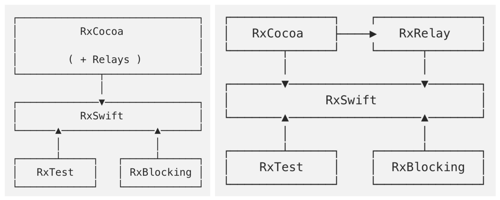
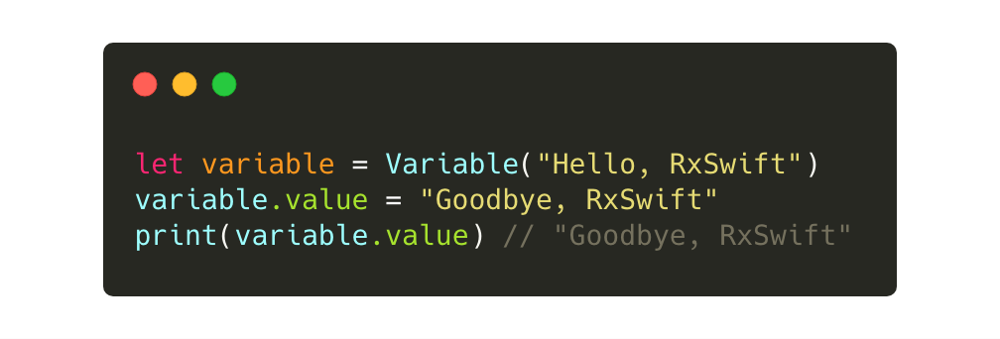
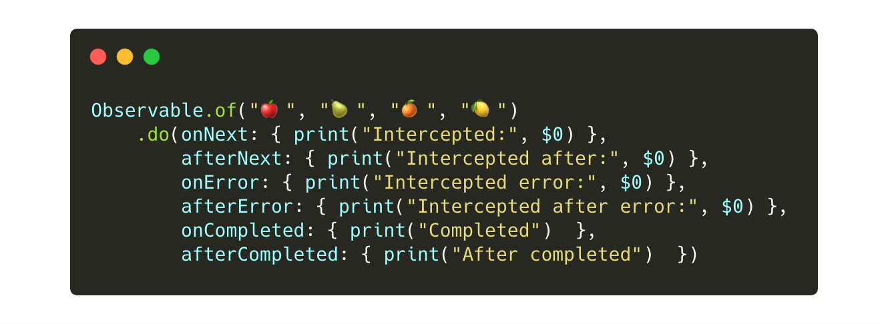
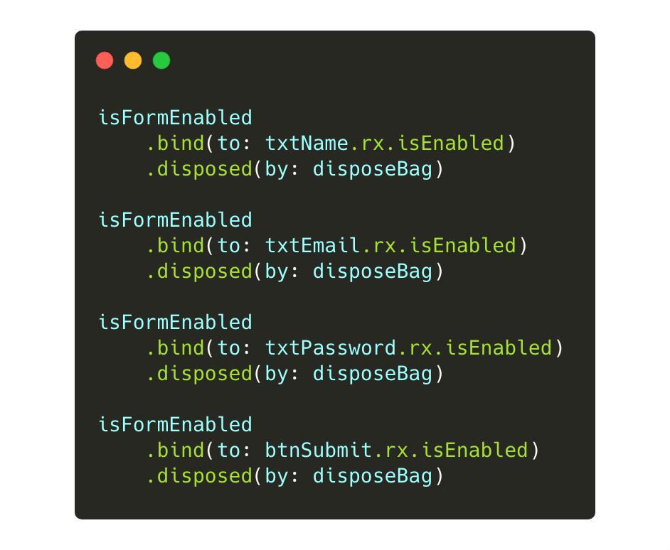
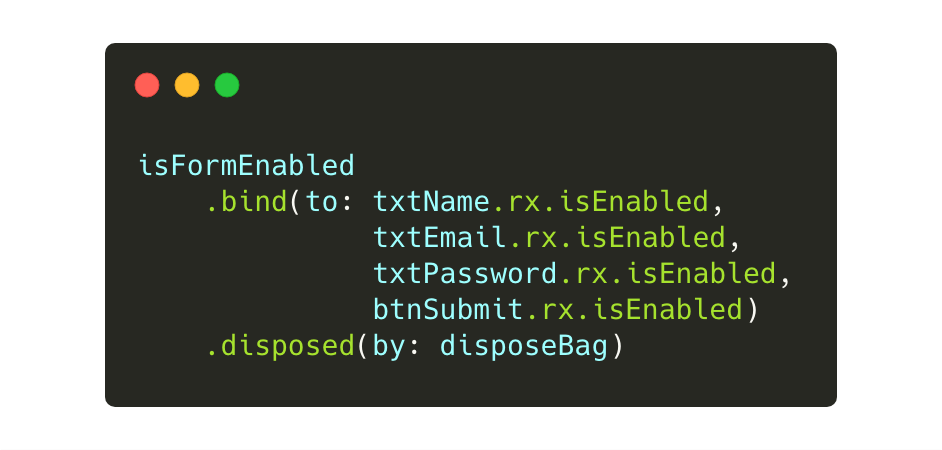
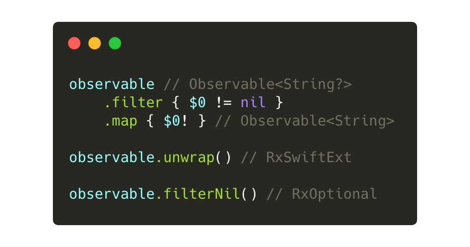
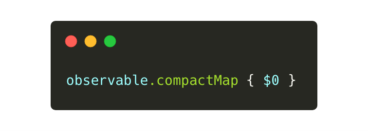
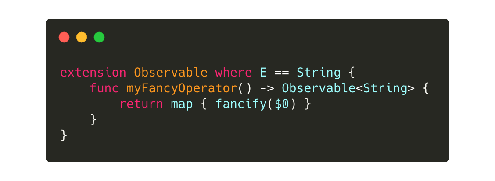
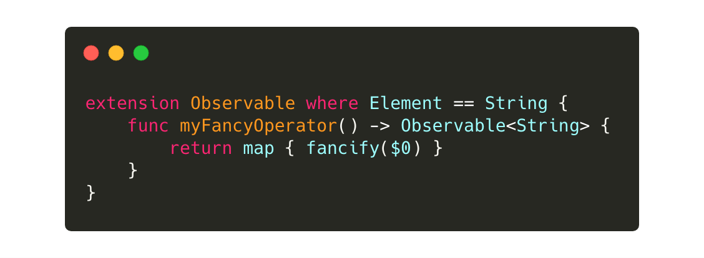

# RxSwift 5 更新了什么？

原文：[What’s new in RxSwift 5](https://medium.com/@freak4pc/whats-new-in-rxswift-5-f7a5c8ee48e7) 作者：[freak4pc](https://github.com/freak4pc)

译注：**在此感谢** [**freak4pc**](https://github.com/freak4pc) **为社区所作出的贡献。**

[RxSwift 5](https://github.com/ReactiveX/RxSwift/releases/tag/5.0.0) 终于发布了，我（[freak4pc](https://github.com/freak4pc)）认为这是一个很好的机会，来分享这次发布中最有价值的更新。

别担心，这次发布几乎是向前兼容的，只有少数弃用和重命名的 API。但它还包含了许多改进，我（[freak4pc](https://github.com/freak4pc)）将在下面详细介绍。

## [RxRelay](rxrelay.md) 现在是一个独立的框架

[RxRelay](rxrelay.md) 是一个在 Subjects 之上很好的抽象层。它可以让我们发出元素，而不用担心 error 和 completed 这样的终止事件。由于它们被添加到 RxSwift 中，并且是 RxCocoa 项目的一部分。

许多开发者对此很不乐意。因为他们如果要使用 Relays 就必须引入 RxCocoa，即便他们编写的代码与 RxCocoa 没有任何关系。这其实是很不合理的。并且这样一来 Linux 用户就无法使用 Relays，因为 Linux 无法导入 RxCocoa。

由于上述原因，[我们将 Relays 拆分成一个独立的框架](https://github.com/ReactiveX/RxSwift/pull/1924) - [RxRelay](rxrelay.md) -- 并且调整 RxSwift 的依赖图，如下：

 左侧： RxSwift 4 依赖图，右侧： RxSwift 5 依赖图

这样我们可以引入 [RxRelay](rxrelay.md)，而不需要导入整个 RxCocoa 框架。并且这也和 [RxJava](https://github.com/ReactiveX/RxJava) 保持一致，因为在 [RxJava](https://github.com/ReactiveX/RxJava) 那边[他也是一个独立的框架](https://github.com/JakeWharton/RxRelay)。

注意：这是一个向前兼容的改动，由于 RxCocoa 依赖于 RxRelay。意味着，只要导入 RxCocoa 并不需要导入 RxRelay，一切就会和以前一样正常工作。

## TimeInterval → DispatchTimeInterval

RxSwift 5 中重构了 [Schedulers](https://github.com/xiejiajian/RxSwift-Chinese-Documentation/tree/5cbf6490bd24fb1202a38515bfa63596cbf5f06f/content/recipes/content/rxswift_core/schedulers.md)，弃用了 `TimeInterval`，转而使用 `DispatchTimeInterval`。这样就与底层时间 API 保持一致，不会丢失精度。

他会影响到所有基于时间的操作符，如：[debounce](https://github.com/xiejiajian/RxSwift-Chinese-Documentation/tree/5cbf6490bd24fb1202a38515bfa63596cbf5f06f/content/recipes/content/decision_tree/debounce.md)，[timeout](https://github.com/xiejiajian/RxSwift-Chinese-Documentation/tree/5cbf6490bd24fb1202a38515bfa63596cbf5f06f/content/recipes/content/decision_tree/timeout.md)，[delay](https://github.com/xiejiajian/RxSwift-Chinese-Documentation/tree/5cbf6490bd24fb1202a38515bfa63596cbf5f06f/content/recipes/content/decision_tree/delay.md)，[take](https://github.com/xiejiajian/RxSwift-Chinese-Documentation/tree/5cbf6490bd24fb1202a38515bfa63596cbf5f06f/content/recipes/content/decision_tree/take.md) 等等。作为额外的收获，他还解决了 [take](https://github.com/xiejiajian/RxSwift-Chinese-Documentation/tree/5cbf6490bd24fb1202a38515bfa63596cbf5f06f/content/recipes/content/decision_tree/take.md) 入参的歧义，因为之前无法判断参数代表多少秒，还是多少个。

### RxSwift 4

### RxSwift 5

## Variable 最终被弃用了

[Variable](../rxswift_core/observable_and_observer/variable.md) 是早期添加到 RxSwift 的概念，通过 “setting” 和 “getting” 他可以帮助我们，从原先命令式的思维方式，过渡到“响应式的思维方式”。

这种做法被证实是有问题的，许多开发者滥用 [Variable](../rxswift_core/observable_and_observer/variable.md)， 来构建 **重度**[**命令式**](https://zh.wikipedia.org/wiki/%E6%8C%87%E4%BB%A4%E5%BC%8F%E7%B7%A8%E7%A8%8B) 系统，而不是 Rx 的 [**声明式**](https://zh.wikipedia.org/wiki/%E5%AE%A3%E5%91%8A%E5%BC%8F%E7%B7%A8%E7%A8%8B) 系统。这对于新手非常常见，并且让他们无法意识到，这是代码的坏味道。所以在 RxSwift 4.x 中 [Variable](../rxswift_core/observable_and_observer/variable.md) 被轻度弃用，仅仅给出一个运行时警告。

在 RxSwift 5.x 中，他被[官方的正式的弃用了](https://github.com/ReactiveX/RxSwift/pull/1922)，并且在需要时，推荐使用 [BehaviorRelay](rxrelay.md) 或者 [BehaviorSubject](../rxswift_core/observable_and_observer/behavior_subject.md)。

### RxSwift 4

### RxSwift 5

## 补充 `do(on:)` 重载方法

[do](../decision_tree/do.md) 是一个很棒的操作符，当你想添加一些[附加作用](side_effects.md)，如：打印日志。

为了与 RxJava 对齐，RxSwift 现在不仅提供 `do(onNext:)`，而且还[提供 after 重载方法](https://github.com/ReactiveX/RxSwift/pull/1898)，例如：`do(afterNext:)`。`onNext` 代表元素发送了，但**未被转发到下游**。而 `afterNext` 代表元素发送了，并**已经被转发到下游**。

### RxSwift 4

### RxSwift 5

## `bind(to:)` 现在支持多个观察者

在一些情况下，你不得不将流绑定到多个观察者上。在 RxSwift 4 中，你通常需要重复绑定代码：

RxSwift 5 现在支持[绑定多个观察者](https://github.com/ReactiveX/RxSwift/pull/1702)： 

## 新增 `compactMap` 操作符

作为开发者，你通常要处理`可选型`。为了将它拆包，社区有专门的解决办法。例如： [RxSwiftExt](https://github.com/RxSwiftCommunity/RxSwiftExt) 的 `unwrap` 操作符，或者 [RxOptional](https://github.com/RxSwiftCommunity/RxOptional) 的 `filterNil` 操作符。

RxSwift 5 新增了一个新的操作符 `compactMap`，从而对齐了 [Swift 标准库](https://developer.apple.com/documentation/swift/sequence/2950916-compactmap)，将这种功能带入到核心库。

### RxSwift 4

### RxSwift 5

## `toArray()` 现在返回 `Single<T>`

`toArray()` 操作符将所有的元素以数组的形式发送出去，在流完成时。

自从 RxSwift 诞生以来，这个操作符一直都是返回 `Observable<T>`，但是在特征序列被引入以后，尤其是 \[Single\]。将返回类型改为 \[Single\] 会更加合适，这不仅提供了类型安全，并且还保证该操作符只会发出一个元素。

### RxSwift 4

### RxSwift 5

## 更新范型约束名称

RxSwift 是范型约束的重度使用者。早些时期，他使用单个字母来表示某个类型。例如，`ObservableType.E` 代表 `Observable` 的元素。

这是可行的，但是有时候会造成混淆，如 `O`， 既可以代表 `Observable`，也可以代表 `Observer`。他们的首字母都是 `O`。另外 `S` 既可以代表 `Subject`, 也可以代表 `Sequence`。

此外，这些单字母约束并不能提供良好的“自解释”代码，并使得项目贡献者以外的人，难以理解他们的含义。

出于这些原因，我们对私有和公共接口的大多数通用约束进行了全面修改，使其更清晰和详细。

影响最大的重命名是将 `E` 和 `ElementType` 改为 `Element`。

### RxSwift 4

### RxSwift 5

这次重命名的范围广泛。下面有一个完整的清单。大多数都是内部 API，只有少数与我们这些开发者相关：

* `E` 和 `ElementType` 改为 `Element`。
* `TraitType` 改为 `Trait`。
* `SharedSequence.S` 改为 `SharedSequence.SharingStrategy`。
* `O` 改为 `Observer` 和 `Source`，仅在适用的情况下。
* `C` 和 `S` 分别被改为 `Collection` 和 `Sequence`。
* `S` 改为 `Subject`，仅在适用的情况下。
* `R` 改为 `Result`。
* `ReactiveCompatible.CompatibleType` 改为 `ReactiveCompatible.ReactiveBase`。

## 社区项目

许多 [RxSwift 社区](http://community.rxswift.org/) 项目已经迁移到 RxSwift 5 ，并且发布了相应的版本。因此迁移过程将会非常平滑。其中一部分已经迁移的项目是： [RxSwiftExt](https://github.com/RxSwiftCommunity/RxSwiftExt), [RxDataSources](https://github.com/RxSwiftCommunity/RxDataSources), [RxAlamofire](https://github.com/RxSwiftCommunity/RxAlamofire), [RxOptional](https://github.com/RxSwiftCommunity/RxOptional)...

## 综上所叙

上面列出来的更改都是与我们开发者息息相关的。还有许多的小修小补，就超出了本文的讨论范围。例如，在Linux下完全修复与Swift 5的兼容性问题等等。

请随意查看完整的更新日志，并参与到官方库的讨论中来：[https://github.com/ReactiveX/RxSwift](https://github.com/ReactiveX/RxSwift)

希望你喜欢这篇文章 :-\)

### 参考

* [What’s new in RxSwift 5](https://medium.com/@freak4pc/whats-new-in-rxswift-5-f7a5c8ee48e7)
* [RxJava](https://github.com/ReactiveX/RxJava)
* [RxSwift 5](https://github.com/ReactiveX/RxSwift/releases/tag/5.0.0)
* [freak4pc](https://github.com/freak4pc)
* [Schedulers](https://github.com/xiejiajian/RxSwift-Chinese-Documentation/tree/5cbf6490bd24fb1202a38515bfa63596cbf5f06f/content/recipes/content/rxswift_core/schedulers.md)
* [timeout](https://github.com/xiejiajian/RxSwift-Chinese-Documentation/tree/5cbf6490bd24fb1202a38515bfa63596cbf5f06f/content/recipes/content/decision_tree/timeout.md)
* [debounce](https://github.com/xiejiajian/RxSwift-Chinese-Documentation/tree/5cbf6490bd24fb1202a38515bfa63596cbf5f06f/content/recipes/content/decision_tree/debounce.md)
* [delay](https://github.com/xiejiajian/RxSwift-Chinese-Documentation/tree/5cbf6490bd24fb1202a38515bfa63596cbf5f06f/content/recipes/content/decision_tree/delay.md)
* [take](https://github.com/xiejiajian/RxSwift-Chinese-Documentation/tree/5cbf6490bd24fb1202a38515bfa63596cbf5f06f/content/recipes/content/decision_tree/take.md)
* [Variable](../rxswift_core/observable_and_observer/variable.md)
* [命令式编程](https://zh.wikipedia.org/wiki/%E6%8C%87%E4%BB%A4%E5%BC%8F%E7%B7%A8%E7%A8%8B)
* [声明式编程](https://zh.wikipedia.org/wiki/%E5%AE%A3%E5%91%8A%E5%BC%8F%E7%B7%A8%E7%A8%8B)
* [BehaviorRelay](rxrelay.md)
* [BehaviorSubject](../rxswift_core/observable_and_observer/behavior_subject.md)
* [do](../decision_tree/do.md)
* [附加作用](side_effects.md)
* \[Single\]

\[Single\]:/content/rxswift\_core/observable/single.md

