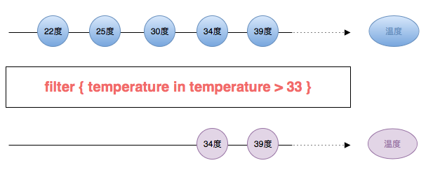
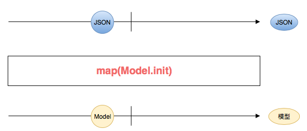
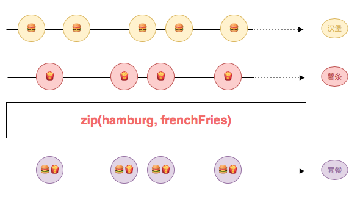

# 4.4 Operator - 操作符


**操作符**可以帮助大家创建新的序列，或者变化组合原有的序列，从而生成一个新的序列。

我们之前在[输入验证](../first_app.md)例子中就多次运用到操作符。例如，通过 [map](../decision_tree/map.md) 方法将**输入的用户名**，转换为**用户名是否有效**。然后用这个转化后来的序列来控制红色提示语是否隐藏。我们还通过 [combineLatest](../decision_tree/combinelatest.md) 方法，将**用户名是否有效**和**密码是否有效**合并成**两者是否同时有效**。然后用这个合成后来的序列来控制按钮是否可点击。

这里 [map](../decision_tree/map.md) 和 [combineLatest](../decision_tree/combinelatest.md) 都是**操作符**，它们可以帮助我们构建所需要的序列。现在，我们再来看几个例子：

## [filter](../decision_tree/filter.md) - 过滤



你可以用 [filter](../decision_tree/filter.md) 创建一个新的序列。这个序列只发出温度大于 33 度的元素。

## [map](../decision_tree/map.md) - 转换



你可以用 [map](../decision_tree/map.md) 创建一个新的序列。这个序列将原有的 **JSON** 转换成 **Model** 。这种转换实际上就是解析 **JSON** 。

## [zip](../decision_tree/zip.md) - 配对



你可以用 [zip](../decision_tree/zip.md) 来合成一个新的序列。这个序列将汉堡序列的元素和薯条序列的元素配对后，生成一个新的套餐序列。

## 如何使用操作符

使用操作符是非常容易的。你可以直接调用实例方法，或者静态方法：

* 温度过滤

  ```swift
  // 温度
  let rxTemperature: Observable<Double> = ...

  // filter 操作符
  rxTemperature.filter { temperature in temperature > 33 }
      .subscribe(onNext: { temperature in
          print("高温：\(temperature)度")
      })
      .disposed(by: disposeBag)
  ```

* 解析 JSON

  ```swift
  // JSON
  let json: Observable<JSON> = ...

  // map 操作符
  json.map(Model.init)
      .subscribe(onNext: { model in
          print("取得 Model: \(model)")
      })
      .disposed(by: disposeBag)
  ```

* 合成套餐

  ```swift
  // 汉堡
  let rxHamburg: Observable<Hamburg> = ...
  // 薯条
  let rxFrenchFries: Observable<FrenchFries> = ...

  // zip 操作符
  Observable.zip(rxHamburg, rxFrenchFries)
      .subscribe(onNext: { (hamburg, frenchFries) in
          print("取得汉堡: \(hamburg) 和薯条：\(frenchFries)")
      })
      .disposed(by: disposeBag)
  ```

## 决策树

[Rx](https://github.com/Reactive-Extensions/Rx.NET) 提供了充分的**操作符**来帮我们创建序列。当然如果内置操作符无法满足你的需求时，你还可以创建自定义的操作符。

如果你不确定该如何选择操作符，可以参考 [决策树](../decision_tree/)。它会引导你找出合适的操作符。

## 操作符列表

> 26个英文字母我都认识，可是连成一个句子我就不怎么认得了...

这里提供一个操作符列表，它们就好比是**26个英文字母**。你如果要将它们的作用全部都发挥出来，是需要学习如何将它们**连成一个句子**的：

* [amb](../decision_tree/amb.md)
* [buffer](../decision_tree/buffer.md)
* [catchError](../decision_tree/catcherror.md)
* [combineLatest](../decision_tree/combinelatest.md)
* [concat](../decision_tree/concat.md)
* [concatMap](../decision_tree/concatmap.md)
* [connect](../decision_tree/connect.md)
* [create](../decision_tree/create.md)
* [debounce](../decision_tree/debounce.md)
* [debug](../decision_tree/debug.md)
* [deferred](../decision_tree/deferred.md)
* [delay](../decision_tree/delay.md)
* [delaySubscription](../decision_tree/delaysubscription.md)
* [dematerialize](../decision_tree/dematerialize.md)
* [distinctUntilChanged](../decision_tree/distinctuntilchanged.md)
* [do](../decision_tree/do.md)
* [elementAt](../decision_tree/elementat.md)
* [empty](../decision_tree/empty.md)
* [error](../decision_tree/error.md)
* [filter](../decision_tree/filter.md)
* [flatMap](../decision_tree/flatmap.md)
* [flatMapLatest](../decision_tree/flatmaplatest.md)
* [from](../decision_tree/from.md)
* [groupBy](../decision_tree/groupby.md)
* [ignoreElements](../decision_tree/ignoreelements.md)
* [interval](../decision_tree/interval.md)
* [just](../decision_tree/just.md)
* [map](../decision_tree/map.md)
* [merge](../decision_tree/merge.md)
* [materialize](../decision_tree/materialize.md)
* [never](../decision_tree/never.md)
* [observeOn](../decision_tree/observeon.md)
* [publish](../decision_tree/publish.md)
* [reduce](../decision_tree/reduce.md)
* [refCount](../decision_tree/refcount.md)
* [repeatElement](../decision_tree/repeatelement.md)
* [replay](../decision_tree/replay.md)
* [retry](../decision_tree/retry.md)
* [sample](../decision_tree/sample.md)
* [scan](../decision_tree/scan.md)
* [shareReplay](../decision_tree/sharereplay.md)
* [single](../decision_tree/single.md)
* [skip](../decision_tree/skip.md)
* [skipUntil](../decision_tree/skipuntil.md)
* [skipWhile](../decision_tree/skipwhile.md)
* [startWith](../decision_tree/startwith.md)
* [subscribeOn](../decision_tree/subscribeon.md)
* [take](../decision_tree/take.md)
* [takeLast](../decision_tree/takelast.md)
* [takeUntil](../decision_tree/takeuntil.md)
* [takeWhile](../decision_tree/takewhile.md)
* [timeout](../decision_tree/timeout.md)
* [timer](../decision_tree/timer.md)
* [using](../decision_tree/using.md)
* [window](../decision_tree/window.md)
* [withLatestFrom](../decision_tree/withlatestfrom.md)
* [zip](../decision_tree/zip.md)

